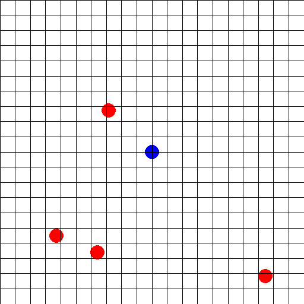

# ProjectHunters
This project combines my interests in deep reinforcement learning with game development.  
The goal of this project is to train a deep reinforcement agent (PPO) on a custom top down VampireSurvivors Clone. Besides being an interesting problem, this could e.g. be used for the development of custom npc behaviours.

For this I developed an small game in Unity that works as an environment for the agent to play in.  
I then created a custom gym environment that relays observations and agent action to and from the Unity environment via UDP Sockets.  
Training is done with [rllib](https://docs.ray.io/en/latest/rllib/index.html), an open source library for reinforcement learning.  
To speed up training I created a script-abstraction of the Unity Environment that mocks the real Unity environment. The real Unity environment is then used by the trained agent during inference.

## Results

The PPO agent is able to learn basic evasive behaviours of incoming enemies relatively quickly after about 1000 distributed training iterations (1h of training).  
The following gif shows the learning progress of the agent after 2000 training iterations: The agent is able to successfully evade enemies, until they die automatically.  

## Setup

### Unity

- Install UnityHub
- Install Unity. Unity Version for development: 2022.3.17f1 (lts).
    - Install Visual Studio with unity
    - If Visual Studio already installed: install Visual Studio extension `Unity Game Development`
- Required Unity Packages:
    - Input System (1.7.0)
    - [LootLocker (2.1.3)](https://github.com/lootlocker/unity-sdk) (requires [git](https://git-scm.com/) on your system)
    - TextMeshPro (3.0.6)

### Python Reinforcement Learning

- Install [python](https://www.python.org/downloads/), [poetry](https://python-poetry.org/docs/)
- Navigate to `python_reinforcement_learning`
- Execute `poetry install`. The python environment with all needed packages should be installed.
